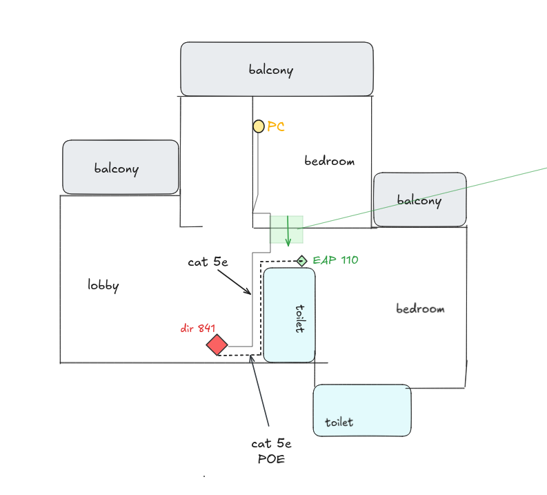
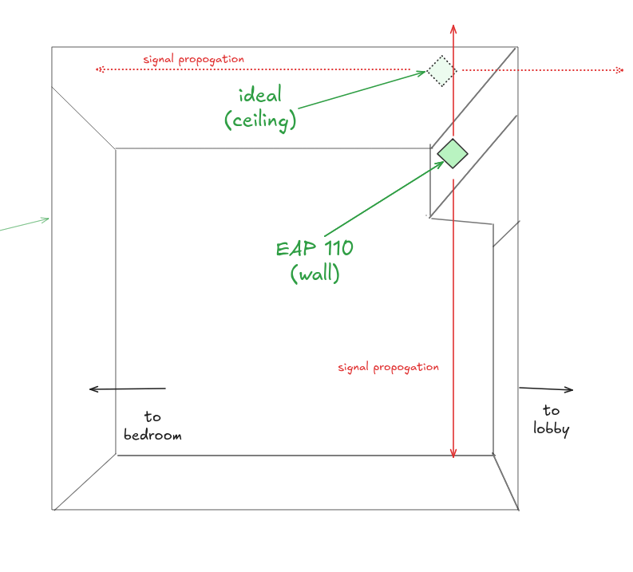
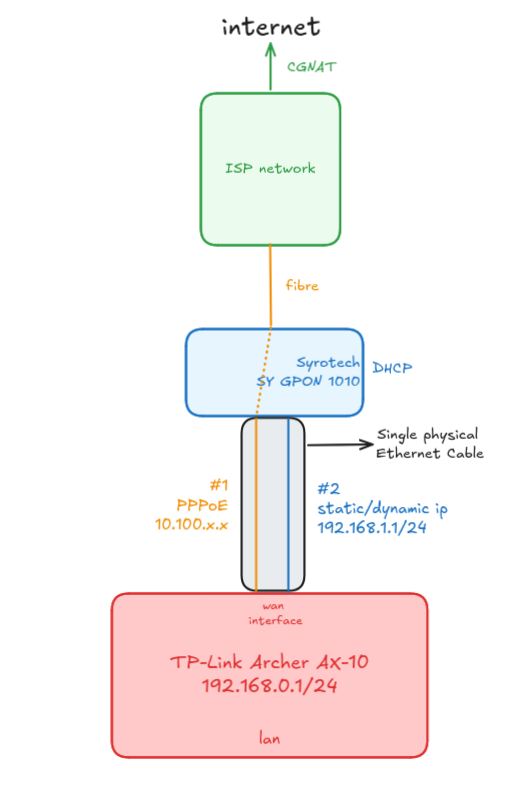
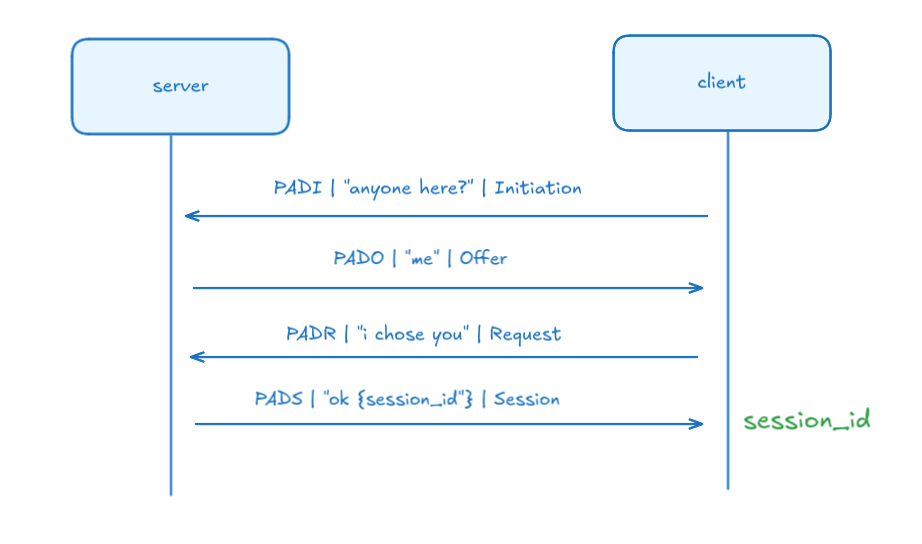
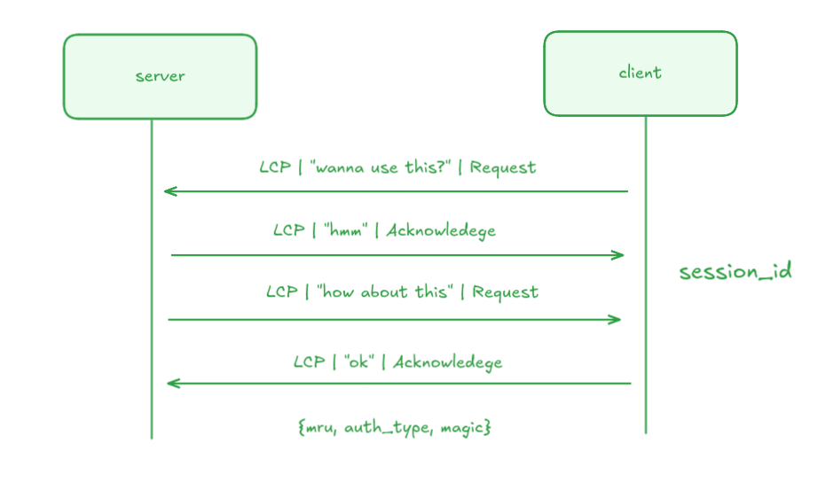
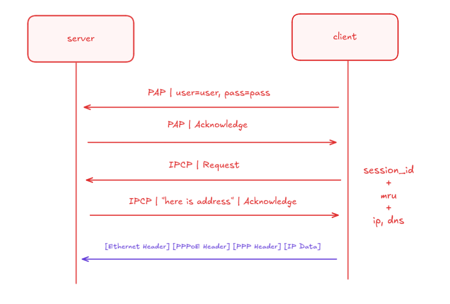
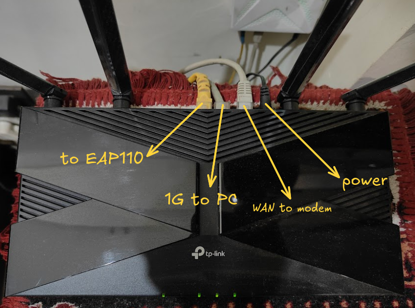
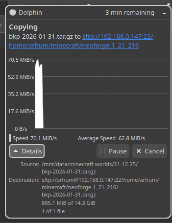

# I. Preface

I've always been fascinated with networking gear pretty much since I got interested in IT in general, however its sort of hard to really understand or internalise a lot of the things without formally studying it, which is generally hard without college, because <i>where do you even start?</i> College education is very formal as well so its easy to get confused there as well.

I mean, you can open up your router settings and if you're lucky, the password is factory default and you get to look around the settings, to not much progress because NOTHING is intuitive. Manufacturers can make the UIs beautiful but buttons here are not really meant to be pushed and toggles to be switched; unless you really know what you're doing. There is a gap.

This was my story as well. Before shifting to my current place of residence, I had purchased the [D-link DIR-841](https://dlink.ru/mn/products/2/2350.html) because that was pretty much very highly rated on Amazon- gave it to my new ISP personnel and called it a day. The connection of 100Mb up/down was up and worked fine, feature-wise nothing crazy but it had support for WiFi 5- 802.11ac so, I was set.

### The first optimisation: separate AP for 2.4 Ghz

I'll make this quick. The positioning of the router at the start of the house and relatively low in height made certain areas of the flat very shaky when it came to reception, I got a separate [Omada EAP110 AP](https://www.omadanetworks.com/in/business-networking/omada-wifi-ceiling-mount/eap110/) because of simple reasons: 

- needed only 2.4Ghz
- cheap
- ceiling mount.

<i>since its just a AP, it doesnt really need a setup of any kind. It is meant to be directly hooked to the main router (for this AP, this will be the gateway) via the LAN port and done.</i>



The EAP 110 is a ceiling mount, but we since we mounted it on the wall, we lost a bit of efficiency:



This was a mistake as I wasnt really aware of its implications at that time. still, this served as my setup
for at least 3-4 years shortly after shifting around the time I left the city for college. My family used this setup without any major problems all this while - until I returned and realised several problems here: 

- the DIR 841 although supports Gigabit WAN, all of its 4 LAN ports are limited to 100Mb down. Wi-Fi wise, only 802.11ac.
- The EAP was experiencing disconnectes probably because of its non-optimal placement.
- I had upgraded to a new PC with support for upto 2.5G LAN. I was very limited here even if I got a better internet plan.

A router upgrade is something I definitely wanted, because I do have a laptop server and since files are frequently copied to-and-fro, an effective 10MB/s throughput is laughably low, even lower than some flash drives.

<i> but how do i upgrade without any help from the ISP? </i>

### First step - figure out the network

**Just LOOK at the config!**

The way my [ISP](https://www.tripleplay.in/) configured the internet was through an ONT connected to the WAN port of my router. Technically speaking, the ONT operates on GPON standards (Tx 1310nm / Rx 1490nm).


A simple MAC address change test revealed that the connection is indeed MAC bound so the new device has to have the same MAC- otherwise the ISP would need to update their configs, which I don't want to do.

Through the same physical WAN interface, we do have 2 connections - one to ISP via PPPoE `10.100.x.x`, the other, A local, separate subnet `192.168.1.1/24`, with just my router and modem. This ensures I can access my modem through my home LAN - `192.168.0.1/24`. The secondary connection will mostly be used to connect to my ISP's so-called "intranet" to get TV, which I'm not using anyways. This is commonly known as **Russian PPPoE** — where PPPoE provides routed internet access, while a secondary IP subnet on the same physical interface provides access to ISP-local services.



So, what is the modem actually doing? Its just a high-tech media converter, turning the fiber optic light signals (PON) into electrical Ethernet signals - **Bridge Mode**. This setup is pretty common, and I'm sort of glad that my ISP didnt completly lock everything down to my modem, instead just using it as a media converter.

So to summarise, my new router should:
1. support PPPoE and optionally, dual connection and, should be at least gigabit
2. prefereably better wifi - where wifi 6 seems most approachable.
3. Gigabit LAN Ports
4. 160Mhz channel width is optional, TBH, but nice to have if found within budget
5. VLAN tagging is required by some ISPs but in my case, no.


## Understanding PPPoE

Let's take a step back to understand whats actually going on.

Our goal is to authenticate ourselves to the server on the other side, while maintaining a distinct session so that its easier to bill. Therefore, we first <i>Discover</i> a Server, <i>Negotiate</i> the link capabilities, <i>Authenticate</i> ourselves, <i>Connect</i> by agreeing on IPs.

Just look at the flow diagram:

### Discovery - PADx



### Negotiate - Link Control Protocol



### Auth and connect - PAP/CHAP + IP Control Protocol



You can see that the final internet traffic has a lot of encapsulation, and thus is CPU bound, or so I'm told..

Anyways, <i>Did I find a router? Well yes:</i>

# II. Getting an upgrade

I ultimately pulled the trigger on the cheaper AX10, and here is why it was the smarter buy for my setup:

- The AX10 has 1.5 GHz Triple-Core CPU. To keep costs down on the newer AX12, TP-Link quietly downgraded it to a dual-core processor. I'd rather have the processing power to handle multiple devices simultaneously without breaking a sweat.

- The AX10 gives me the standard 4 Gigabit LAN ports. The AX12 inexplicably drops one, offering only 3.

- While the AX12 technically has slightly better 2.4GHz radio sensitivity for extreme range, the AX10 covers my home just fine because I have a dedicated AP for 2.4Ghz anyways.

It arrived a day later and we were ready to go down to business.



### Well, Did my understanding work?

Yes, and expectedly so. Soon after booting the router up, and hooking it up to my PC:
- Connected the ethernet from the ONT to the WAN port on the router,
- Internet -> PPPoE -> credentials then let it dial, understandably didnt succeed. Then,
- Advanced - MAC clone -> old router's MAC address; and sure enough, it worked. 

From that point forward, it was just me setting up the WiFi properly, even access control to only access the router config page from certain MACs.

For the secondary connection, we simply click the Advanced settings - In **"secondary connection"**, select Static IP- since the ONT has a DHCP server running, it will function.

We give the IP `192.168.1.2` with subnet mask as `255.255.255.0`. These settings ensure that we target the ONT with the address `192.168.1.1`. Note that in order to get TV, you would have to actually select Dynamic IP so that it requests a "local" IP from the ISP servers upstream (different from the Internet one). This means no more accessing the ONT's interface :<

### Interesting routing auto-config

Based on the network diagram shown before, we can come up with "pseudo" logical routes the packets can take. These can be: 

- if its `192.168.0.x` - send to LAN interface
- if its `192.168.1.x` - send to WAN port - interface #2 for the ONT link
- anything else thats valid - WAN port - interface #1 for main PPP link

The third rule here seems un-intuitive - "anything else" isnt a viable route. what is "anything else", **a default!**

all Ips `0.0.0.0 -> WAN` via interface #1 (main PPP link)

Since PPP is "point to point" there is no deducing the other side. We know the gateway while it negotiated the entire connection; a formal way to write this Route would be:
`0.0.0.0/0 → via 10.100.0.1`

All this configuration is auto-deduced. How neat!

# III. Seeing a difference

We wont see a meaningful difference in **internet** speed tests. However:

### Local file transfer

PC via Cat5E Ethernet:
```bash
arhum@b850mfedora:~$ ethtool enp10s0 | grep -E "Speed|Duplex|Link detected"
        Speed: 1000Mb/s
        Duplex: Full
        Link detected: yes
```

Laptop (ssh) via Wi-Fi 5:
```bash
arhum@arhum-ubuntu:~$ iw dev wlo1 link | grep "rx"
        rx bitrate: 866.7 MBit/s VHT-MCS 9 80MHz short GI VHT-NSS 2
```

So we have a `1Gbps -> 866Mbps (via Wi-Fi 5)` DIRECT PHY link (These are just link speeds). In real case, this should translate to about ~70MB/s bandwidth, accounting for losses on the wireless end. If my laptop supported Wi-Fi 6, we could have seen slightly higher speeds, but this upgrade (5-6) was never meant to be for speed.

Wi-Fi 6 will shine in cases where I'm transferring large files in my local network <i>and</i> someone is also stremaing in HD. Wifi 6 also improved range of 5Ghz a little bit more for me, so I rely on 2.4Ghz a lot less now.

Anyways:



SPOT ON!

# IV. Closing thoughts

Nothing; I call this, mission accomplished - since <i>what I spent</i> vs <i>what I got</i> vs <i>what I needed</i> seems very balanced relative to each other.

In the future, I might even consider getting even higher end models- who doesnt love overkill?