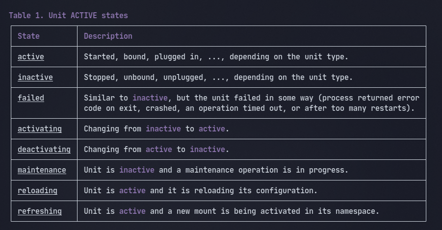
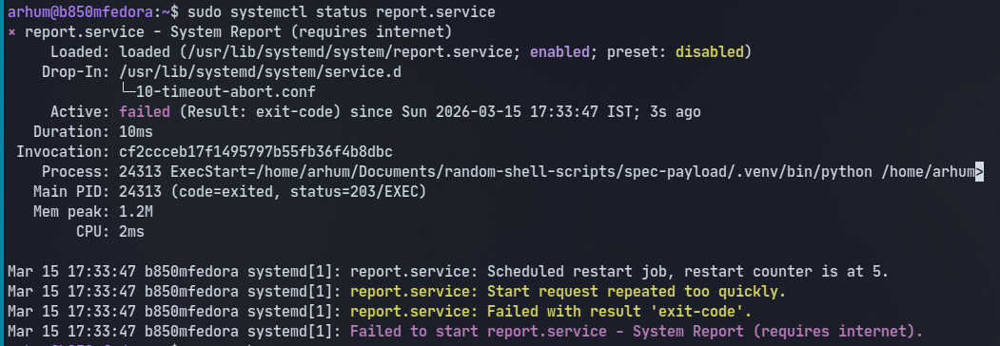
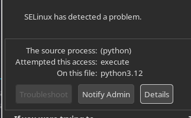
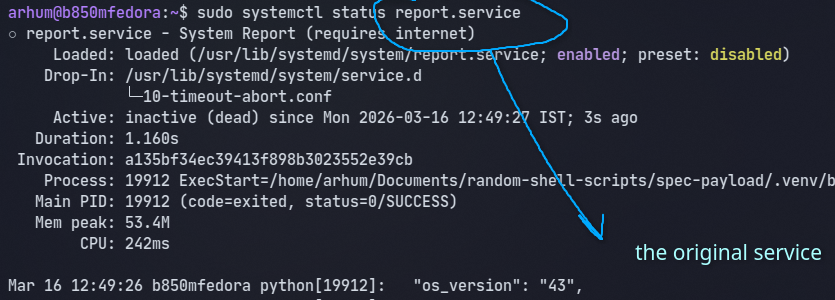

# I. Preface

When the bulk of my personal [space](https://space.arhm.dev) was being built, I naturally came up with a bizzare idea - "wouldnt it be cool if this site knew if I was online? perhaps I can also send it my current specs as well for everyone to see along with timestamps (if I'm online, when?), since I'm about to get a new PC soon"; This was sort of easy to achieve because the frontend had a go based [backend](https://s-pxy.arhm.dev) and I also knew redis offered a 25MB free tier. 

Now, I dont wanna hear that "redis isnt a full fledged database" try getting a managed database service for free in this day and age, then we'll talk. Anyways, half a day later everything was deployed, and after a mandatory half day more to troubleshoot stuff not working, I was up and running for real this time. Very naturally, I thought - <i> This will be perfect if I can run this script at boot and at shutdown to finish this off</i>, Shutdown mode here hits a `DELETE` api which just removes the hard coded key for report. The frontend tries to `GET` this key, and we can either get a report payload, or nothing, and it can display the UI based on that. Pretty neat, I thought.

## The script tech

To summarise - its [`uv`](https://docs.astral.sh/uv/) along with the following deps:

```toml
dependencies = [
    "aiohttp>=3.12.15", # async http requests and stuff
    "distro>=1.9.0", # for linux, gets the proper distro name
    "dotenv>=0.9.9", # env parsing
    "psutil>=7.1.0", # cross platform lib for running processes and system util
    "py-cpuinfo>=9.0.0", # abstracts getting cpu model, other details
    "pydantic>=2.11.9", # models
    "setuptools>=80.9.0", # `distutils` was removed with py 3.12, that and we need to install setuptools to make GPUtils work.

]
```
As usual, the script can be found [here]() but in a nutshell it looks something like: 

```python
os_name, os_version = get_os_info(system) # a helper to format based on platform
    
    payload_data = {
        "arch": platform.machine(),
        "os_name": os_name,
        "os_version": os_version,
        "cpu": cpuinfo.get_cpu_info().get("brand_raw", "Not detected"),
        "memory_gb": math.ceil(psutil.virtual_memory().total / (1024**3)),
        "gpus": get_gpu_info(system), # another helper
        "timestamp": int(time.time())
    }
    
    return SystemInfo(**payload_data) # parse this as a JSON body and send
```

## Auto execution on boot/shutdown

Now that we have the script, next step would be to run it automatically on boot and shutdown, which on windows, can be setup using task scheduler. Its really a breeze; just point it to the python executable, set the triggers, and it just worked. For linux, my daily driver at the time was [Mint](https://linuxmint.com/). The natural Linux equivalent for this kind of background automation is `systemd`.

### systemd

I would recommend [this video](https://www.youtube.com/watch?v=EjrAzulPsT4&t=1571s) in order to understand the full process of booting. It covers everything, from BIOS, to POST and these are directly not related to systemd in any way. However, the latter part is gold.

If we do 

```bash
$ man systemd
```

they describe it as:

<i>"systemd is a system and service manager for Linux operating systems. When run as first process on boot (as PID 1), it acts as init system that brings up and maintains userspace services. Separate instances are started for logged-in users to start their services."</i>

going further:

```bash
$ man systemd.service
```
it says:

<i>"A unit configuration file whose name ends in ".service" encodes information about a process controlled and supervised by systemd."</i>

**Essentially, systemd works with 'units' and has to 'activate' all of the user-space systems in order to get the system fully functioning. It starts as the first, and then gets to work. Naturally, all units have a state attached to it, representing how "it is" at a moment (running? dead? errored? those sort of things)**



To make this work, I had to ensure two things:

- The script absolutely could not run until the machine had an active internet connection  (otherwise, no Redis payload sending).

- It needed the venv because of the packages. That means, we need to point it to the actual binary.

To save you the trouble, you would have to create a `.service` file and register it with systemd. Instead of getting confused with all the different options it has to offer, why not take a look at mine:

``` bash
# /usr/lib/systemd/system/report.service
[Unit]
Description=System Report (requires internet)
After=network-online.target
Wants=network-online.target

[Service]
Type=simple
WorkingDirectory=/home/arhum/Documents/random-shell-scripts/spec-payload
ExecStart=/home/arhum/Documents/random-shell-scripts/spec-payload/.venv/bin/python /home/arhum/Documents/random-shell-scripts/spec-payload/main.py
User=arhum
Restart=on-failure
Environment=PYTHONUNBUFFERED=1

[Install]
WantedBy=multi-user.target
```

Notice the `After=network-online.target` to ensure the network was up, and the incredibly long, explicit path in `ExecStart=` pointing systemd to the Python binary. `main.py` in the same directory is the filename that we need to run.

### The problem started not with Mint, but with Fedora

This service was alive and kicking on mint, but on Fedora, it didnt.

One nice thing about systemd units is even though this one is configured to run at boot, we can also invoke it at will. so, just by running:

```bash
$ sudo systemctl start report.service
```

we get:


Look at the code - **203/EXEC** as well as in the logs:

<i>"restart counter is at 5"</i> suggesting it actually tried re-running it, and failed. Safe to say, this unit would also fail at boot. The same service ran on Mint.

Running it like this also meant that I recieved a notification from some plugin on KDE. it was something like:



<i>SELinux?</i>

# II. Summary

## TL;DR: The 203/EXEC Troubleshooting Checklist
If you arrived here via a frantic Google search (Wait did my SEO work?) because your systemd service is failing with a `status=203/EXEC` error on Fedora, RHEL, or CentOS, run through this checklist to see if you've fallen into the same SELinux trap.

- **Is this even SELinux?**

Find the Main `PID` from your failed `systemctl status` output and check the audit logs:

```bash
sudo ausearch -m AVC -p <YOUR_FAILED_PID>
# Or, if you don't have the PID anymore:
sudo ausearch -m AVC -ts recent
```

<i>What to look for</i>: If the output shows `denied { execute }, scontext=...init_t, and tcontext=...user_home_t (or data_home_t),` SELinux is blocking systemd from running your user-level script.

- **Symlinks?**

Are you using a modern package manager like `uv`, `poetry`, or `pnpm`? Your local executable might just be a symlink to a global cache. Check its true destination:

```bash
readlink -f /path/to/your/project/.venv/bin/python
```

<i>Why it matters</i>: SELinux evaluates the permissions of the ultimate target, not the symlink. Changing the SELinux label of your .venv symlink does absolutely nothing.
Do `ls -Z` on the target.

## Properly is also possible

If you want systemd to execute the binary directly without a wrapper, you must permanently change the SELinux context of the true target binary (found in Step 2) to a trusted executable type (`bin_t`).

```bash
# 1. Add the rule to the SELinux policy
sudo semanage fcontext -a -t bin_t "/home/youruser/.local/share/uv/.../bin/python3.12"

# 2. Apply the rule to the actual file
sudo restorecon -v "/home/youruser/.local/share/uv/.../bin/python3.12"
```

That should cover most use cases.

However if you like diving deep, read on.

# III. Deep Dive - There is more to this than you think

### About SELinux

The best resource for this is the [official docs.](https://docs.redhat.com/en/documentation/red_hat_enterprise_linux/8/html/using_selinux/getting-started-with-selinux_using-selinux) This document, however, is not docs, so what I'll do instead is relate its properties to what I'm trying to do here.

Any Linux distribution, Fedora included, utilize an additional security layer known as SELinux (Security-Enhanced Linux). Unlike traditional UNIX permissions (`chmod +x`), which primarily control access through user and group ownership, SELinux introduces a policy-based system that governs how processes are allowed to interact with files, devices, and other system resources.

<i>"All files, directories, devices ... have a security context/label associated with them."</i>

Every process and file on the system is assigned a security context that describes its role within the policy. A typical label might look something like this:

`unconfined_u:object_r:bin_t:s0`

>The key part of the context is the `bin_t` type, which marks trusted system executables (like those in `/usr/bin`). SELinux uses this **type enforcement** to decide if a process can interact with a file, based on both the process's domain and the file's type. Files in user directories are usually labeled as `user_home_t` or `data_home_t`, marking them as user-controlled and less trusted.

This distinction becomes important when system services are involved. Services started by systemd often run under restricted domains, and SELinux policies may prevent them from executing files that are labeled as user data. The idea behind this restriction is straightforward: **if a privileged service were allowed to execute arbitrary files from a user's home directory, a compromised user account could potentially influence what code the service runs.**

So, doing: 

```bash
$ ls -Z /home/arhum/Documents/random-shell-scripts/spec-payload/.venv/bin/python
```

I get:

```bash
unconfined_u:object_r:bin_t:s0 /home/arhum/Documents/random-shell-scripts/spec-payload/.venv/bin/python
```

<i>It does say **bin_t**, what gives?</i>

### Symlinks!

The answer lies in how modern Python tooling works, specifically uv.

To save disk space and create virtual environments in milliseconds, uv doesn't actually copy the Python binary into your .venv folder. **Instead, it creates a symlink pointing to a central cache deep inside your home directory.**

When systemd makes the execve() system call to start the service, the Linux kernel resolves that symlink. And crucially, SELinux evaluates the permissions of the ultimate target, not just the symlink.

So, I followed the symlink and checked the context of the actual Python binary:

```bash
arhum@b850mfedora:~$ ls -Z ~/.local/share/uv/python/cpython-3.12.12-linux-x86_64-gnu/bin/python3.12

unconfined_u:object_r:data_home_t:s0 /home/arhum/.local/share/uv/python/cpython-3.12.12-linux-x86_64-gnu/bin/python3.12
```

`data_home_t`. Hmm.

Okay, this specific case makes sense, but,

### Why deny data_home_t and allow bin_t?

In a few words:

**Because bin_t (Binary Type) is the standard label for system-wide executables (/bin, /usr/bin, /usr/local/bin). These directories are owned by root.**

**They also, inherit the labels of their parent directory.**. The default policies are meant to be enough for almost all day-to-day usecases.

> Think of policies like firewall rules on a webserver, and like those, you can actually view them yourself

### sesearch & ausearch

Now that we know the wrapper worked because /usr/local/bin gave it a trusted bin_t label, I wanted to prove the underlying rule without digging through dense Red Hat documentation.

Enter `sesearch`, a command-line tool that lets you query your system's active SELinux policy rules.

Systemd runs as the `init_t` process. I wanted to ask SELinux: <i>"Are you allowed to execute files labeled `data_home_t`?"</i>

Translate this english question to a query we get (nothing)

```bash
$ sesearch -A -s init_t -t data_home_t -c file -p execute
<none>
```

`ausearch` will allow us to see the denial from the AVC (Access Vector Cache). so searching for the PID of the output before:

```bash
arhum@b850mfedora:~$ sudo ausearch -m AVC -p 24313
[sudo] password for arhum: 
----
time->Sun Mar 15 17:33:47 2026
type=AVC msg=audit(1773576227.057:684): avc:  denied  { execute } for  pid=24313 comm="(python)" name="python3.12" dev="nvme0n1p3" ino=26377196 scontext=system_u:system_r:init_t:s0 tcontext=unconfined_u:object_r:data_home_t:s0 tclass=file permissive=0
```

This all checks out, Don't you think?

## Turns out, I accidentally solved this issue

Without knowing the underlying details, I had suspected that it was somehow related to permissions. However, since I didnt want to move entire source code stuff outside of `/home`, I thought of making a bash script. And sure enough one like:

```bash
# /etc/systemd/system/system-report.service
[Unit]
Description=System Report (requires internet)
After=network-online.target
Wants=network-online.target

[Service]
Type=simple
ExecStart=/usr/local/bin/rep.sh
User=arhum
WorkingDirectory=/home/arhum/Documents/random-shell-scripts/spec-payload
Restart=on-failure
Environment=PYTHONUNBUFFERED=1

[Install]
WantedBy=multi-user.target
```

worked: 

```basharhum@b850mfedora:~$ sudo systemctl status system-report.service
○ system-report.service - System Report (requires internet)
     Loaded: loaded (/etc/systemd/system/system-report.service; enabled; preset: disabled)
    Drop-In: /usr/lib/systemd/system/service.d
             └─10-timeout-abort.conf
     Active: inactive (dead) since Mon 2026-03-16 12:01:03 IST; 33s ago
   Duration: 1.757s
 Invocation: 4ca645e93805476bbe6d4311035ed21c
    Process: 15735 ExecStart=/usr/local/bin/rep.sh (code=exited, status=0/SUCCESS)
   Main PID: 15735 (code=exited, status=0/SUCCESS)
   Mem peak: 53.4M
        CPU: 204ms

Mar 16 12:01:02 b850mfedora rep.sh[15735]:   "os_version": "43",
Mar 16 12:01:02 b850mfedora rep.sh[15735]:   "cpu": "AMD Ryzen 5 9600X 6-Core Processor",
Mar 16 12:01:02 b850mfedora rep.sh[15735]:   "memory_gb": 31.0,
Mar 16 12:01:02 b850mfedora rep.sh[15735]:   "gpus": [
Mar 16 12:01:02 b850mfedora rep.sh[15735]:     "AMD Navi 44 [Radeon RX 9060 XT] (rev c0)",
Mar 16 12:01:02 b850mfedora rep.sh[15735]:     "AMD Granite Ridge [Radeon Graphics] (rev c6)"
Mar 16 12:01:02 b850mfedora rep.sh[15735]:   ]
Mar 16 12:01:02 b850mfedora rep.sh[15735]: }
Mar 16 12:01:03 b850mfedora rep.sh[15735]: Data sent for Monday, 16. March 2026 12:01PM
Mar 16 12:01:03 b850mfedora systemd[1]: system-report.service: Deactivated successfully.

```

The reason is pretty simple actually, and you can also see for yourself. if we go to something like `/usr/local/bin` and:

```bash
$ sudo touch test.sh && ls -Z test.sh
```

sure enough we get `unconfined_u:object_r:bin_t:s0 test.sh` 

It has **INHERITED ITS LABEL FROM THE PARENT** and therefore, the wrapper method will work and probably is the best way to go about this.


### The "Proper" Fix: Changing the Policy
If I didn't want to use the wrapper script, the solution was simple: I needed to change the label of the actual Python binary that uv was symlinking to.

To test this, you can use `chcon` (Change Context), which temporarily alters the SELinux context of a file:

```bash
$ sudo chcon -t bin_t ~/.local/share/uv/python/cpython-3.12.12-linux-x86_64-gnu/bin/python3.12
```

and well:




# IV. Conclusion

As always, I have nothing much to say to conclude, I just hope it was as interesting to you as it was for me, even better if you came from a Google Search (I havent paid much attention to SEO yet)